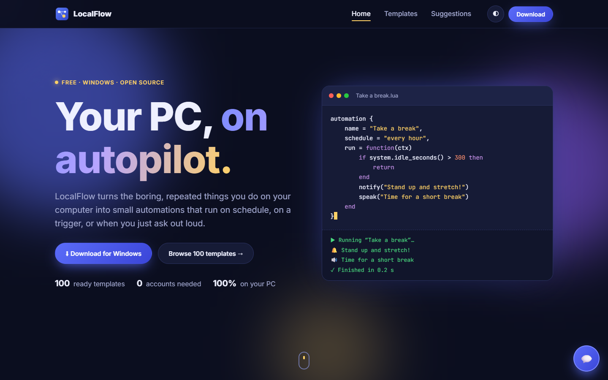

<i>&ldquo;I have no enemies.&rdquo; - Vinland Saga</i>

 

## ⚡ Featured project

### [LocalFlow](https://github.com/HoPMaLbHblu/LocalFlow) — your PC, on autopilot

Small Lua automations for Windows and macOS that run on a schedule, on a trigger, 
or when you just ask out loud. 100 ready templates, voice control, Telegram remote — all on your own computer.

💡 Have an idea? <a href="https://localflow-9dp.pages.dev/suggestions">Suggest a feature</a> · 💬 <a href="https://localflow-9dp.pages.dev">Chat with me on the site</a>

